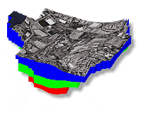

# Welcome!

    

This page was created as a data resource to anyone working with, or just curious about, the Woburn Massachusetts ground water contamination site featured in the best-selling book "A Civil Action" by Jonathan Harr and the Hollywood movie by the same name. This web site was originally developed as a resource for students in [CE En 647 - Ground Water Modeling](http://ce547.groups.et.byu.net/syllabus/) taught by [Dr. Norm Jones](http://www.emrl.byu.edu/njones/) at [Brigham Young University](http://www.byu.edu). However, anyone is welcome to use the information found here.

## **Highlights**

- **[Photo Gallery](photos/index.md)**: Some great photos of the site
- **[USGS Plates](usgs/index.md)**: The maps related to the USGS study are now available
- **[Complete NUS Report](nus/index.md)**: The entire NUS report is now online, including all of the plates
- **[Virtual Tour](tour/index.md)**: Interactive tour of the site by viewing photos from several viewpoints
- **[Well Logs](welllogs/index.md)**: View map of well log locations with symbols linked to well log documents
- **[Aerial Photos](maps/index.md)**: Two new aerial photos in JPEG format and USGS topo map in smaller JPEG format

---

## **Acknowledgments**

I would like to thank all of the individuals and organizations that provided the data on this site, including:

* Ronald St. John
* [US Environmental Protection Agency](http://earth1.epa.gov/)
* [US Geological Survey](http://www.usgs.org/)
* Jack Guswas, [GeoTrans](http://hsigeotrans.com/)
* Oscar Soule, [Evergreen State College](http://www.evergreen.edu/user/home.htm)
* John Drobinski
* [Scott Bair, Ohio State University](http://www.geology.ohio-state.edu/~esbair/)

---

This page is maintained by [**Norm Jones**](http://emrl.byu.edu/njones/) of the [Environmental Modeling Research Laboratory](http://emrl.byu.edu/) of [Brigham Young University](http://www.byu.edu). If you have any comments, suggestions, or additional data, please contact me at: [njones@byu.edu](mailto:njones@byu.edu).

I would like to thank Chris Lynn and Mike Lasswell for helping me put together this site.

---

*Page last edited: 12/02/2013* 