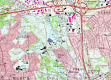
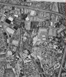
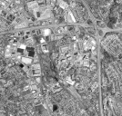

# Digital Maps

## Digital Mapping Resources

The following three maps are available in digital form:

## Available Maps

| Map Type | Preview | Size | Download |
|----------|---------|------|----------|
| **USGS Quad Map** |  | 1,181 KB | [topo.zip](topo.zip) |
| **Aerial Photo #1** |  | 664 KB | [photo1.zip](photo1.zip) |
| **Aerial Photo #2** |  | 596 KB | [photo2.zip](photo2.zip) |

## Map Details

The aerial photos were taken at different times and cover slightly different areas. Both are good quality. Aerial photo #1 is courtesy of Scott Bair. The other two maps were downloaded from the web (I forgot the original location!). All three maps include the Aberjona aquifer region of Woburn.

## Download Instructions

To download an image, simply click on the file name and follow the instructions. Each zip file contains two files:

1. **A JPEG file (*.jpg)** - The actual map image
2. **A GMS Image file (*.img)** - This is a simple text file used by GMS to import and register TIFF and JPEG images.

## Usage

Unzip the files and keep them in the same directory. If you open the image file in GMS the JPEG image will appear, registered to state plane coordinates (in ft).

---

*Content extracted from the original Woburn website* 