# Jeff Davis - Alan Lemon Photos

## Photo Gallery from 2001 Site Visit

This series of photos was taken by Jeff Davis and Alan Lemon on a visit to the Woburn site in April of 2001. Click on each thumbnail to see a larger image. Commentary provided by Jeff Davis.

## Photo Gallery

| | | | |
|---------|---------|---------|---------|
| 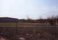 **Back of W.R. Grace where they are still cleaning stuff up** | [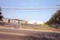](Image2.jpg) **Front of W.R. Grace facility** | [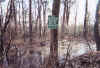](Image3.jpg) **Sign close to wells G&H** | [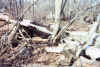](Image4.jpg) **What remains of well H** |
| [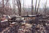](Image5.jpg) **The other side of the remains of well H** | [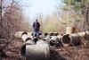](Image6.jpg) **Next to well H, one of the great hockey players of our time (RJD)** | [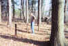](Image7.jpg) **AML admiring an observation well** Compare to [location 3](../../tour/location3.htm) in [Virtual Tour](../../tour/index.md). | [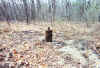](Image8.jpg) **Well G?** |
| [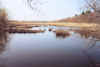](Image9.jpg) **Looking north from bridge across the Aberjona River** Compare to [Location 1d](../../tour/location1d.htm) in [Virtual Tour](../../tour/index.md). | [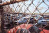](Image10.jpg) **This is close to [location 14](../../tour/location14.htm)** Under the tires is supposed to to be a huge pile of buried 55 gallon drums. | [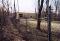](Image11.jpg) **This is the facility that treats the contamination from the SVE remediation** | [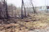](Image12.jpg) **This is part of the 15 acres area** This is the area that caught on fire in the movie |
| [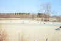](Image13.jpg) **The SVE remediation project that we got a tour of** Note, this is year 4 of a 5 year clean-up project that has reclaimed very little contamination | [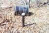](Image14.jpg) **Just North of 15 acres** An area that we were told will never be cleaned up because of the lack of money | 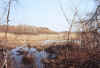 **close to [location 8](../../tour/location8a.htm) looking East across the marsh** | 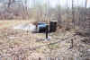 **Close to [location 8](../../tour/location8a.htm). More bad stuff that will sit forever** |
| [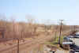](Image17.jpg) **Similar to [location 4c](../../tour/location4c.htm)** | 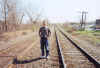 **On the tracks looking South. Nice guy that Alan Lemon!** | | |

---

[← Back to Photo Gallery](../index.md) 