# Site Investigation

## Photo Gallery of the Original Site Investigation

These photos are from the original site investigation made by the plaintiffs. The photos were provided by John Drobinski, the geologist who led the investigation. Many of the photos illustrate rusted 50 gallon drums and other debris that were found at the "fifteen acre" site.

Click on each thumbnail to see a larger image.

## Photo Gallery

| | | | |
|---------|---------|---------|---------|
| [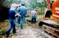](image1.jpg) **Digging an exploratory trench** The man in the trench with the red hard hat is Jan Schlictman. | [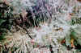](image2.jpg) **Unknown location** | [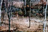](image3.jpg) **Monitoring wells** | [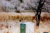](image4.jpg) **Looking across the marsh** |
| [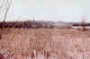](image5.jpg) **Looking East across the marsh** Notice the Riley Tannery smokestack in the background. | [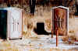](image6.jpg) **Testing equipment** | [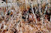](image7.jpg) **50 gallon drum in the fifteen acres** | [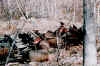](image8.jpg) **50 gallon drums and other debris in the fifteen acres** |
| [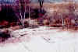](image9.jpg) **Fifteen acres** | [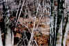](image10.jpg) **Debris** | [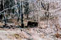](image11.jpg) **50 gallon drum in the fifteen acres** | [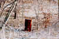](image12.jpg) **50 gallon drum in the fifteen acres** |
| [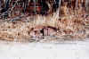](image13.jpg) **Debris** | [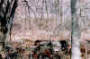](image14.jpg) **Debris** | [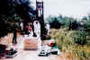](image15.jpg) **Digging a monitoring well** | |

---

[← Back to Photo Gallery](../index.md) 