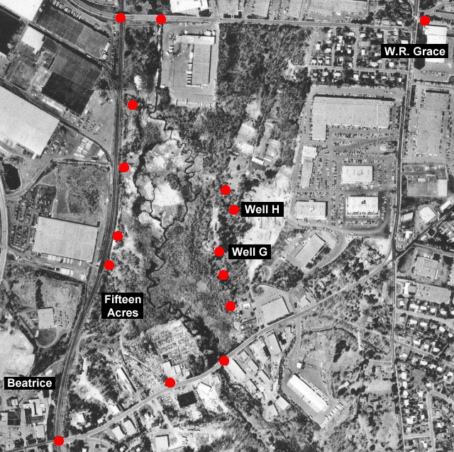

# Virtual Tour

## Welcome to the Virtual Tour

Click on each red dot to view a set of photos taken at that location. Aerial photo provided courtesy of Scott Bair. Individual photos by Norm Jones and Oscar Soule.

## Interactive Tour Map

The map below has clickable red dots that will take you to photos from each location. Click on any red dot to view photos from that specific location.

    
    
    <!-- Invisible clickable areas positioned over the original red dots -->
    

    

    

    

    

    

    

    

    

    

    

    

    

    

    

*Click on the red dots on the map above to view photos from each location*

## Tour Locations

### Area 1 - Northern Section
- [Location 1A](location1a.htm) - Photos from northern viewpoint A
- [Location 1B](location1b.htm) - Photos from northern viewpoint B  
- [Location 1C](location1c.htm) - Photos from northern viewpoint C
- [Location 1D](location1d.htm) - Photos from northern viewpoint D
- [Location 1E](location1e.htm) - Photos from northern viewpoint E

### Area 2 - Northeast Section
- [Location 2A](location2a.htm) - Photos from northeast viewpoint A
- [Location 2B](location2b.htm) - Photos from northeast viewpoint B

### Area 3-4 - Central Section
- [Location 3](location3.htm) - Photos from central viewpoint
- [Location 4A](location4a.htm) - Photos from central viewpoint A
- [Location 4B](location4b.htm) - Photos from central viewpoint B
- [Location 4C](location4c.htm) - Photos from central viewpoint C
- [Location 4D](location4d.htm) - Photos from central viewpoint D
- [Location 4E](location4e.htm) - Photos from central viewpoint E

### Area 5-6 - Western Section
- [Location 5](location5.htm) - Photos from western viewpoint
- [Location 6A](location6a.htm) - Photos from western viewpoint A
- [Location 6B](location6b.htm) - Photos from western viewpoint B
- [Location 6C](location6c.htm) - Photos from western viewpoint C

### Area 7-8 - Southwest Section
- [Location 7A](location7a.htm) - Photos from southwest viewpoint A
- [Location 7B](location7b.htm) - Photos from southwest viewpoint B
- [Location 8A](location8a.htm) - Photos from southwest viewpoint A
- [Location 8B](location8b.htm) - Photos from southwest viewpoint B
- [Location 8C](location8c.htm) - Photos from southwest viewpoint C

### Area 9-10 - Southern Section
- [Location 9A](location9a.htm) - Photos from southern viewpoint A
- [Location 9B](location9b.htm) - Photos from southern viewpoint B
- [Location 9C](location9c.htm) - Photos from southern viewpoint C
- [Location 9D](location9d.htm) - Photos from southern viewpoint D
- [Location 9E](location9e.htm) - Photos from southern viewpoint E
- [Location 9F](location9f.htm) - Photos from southern viewpoint F
- [Location 9G](location9g.htm) - Photos from southern viewpoint G
- [Location 9H](location9h.htm) - Photos from southern viewpoint H
- [Location 10A](location10a.htm) - Photos from southern viewpoint A
- [Location 10B](location10b.htm) - Photos from southern viewpoint B
- [Location 10C](location10c.htm) - Photos from southern viewpoint C

### Area 11-12 - Southeast Section
- [Location 11A](location11a.htm) - Photos from southeast viewpoint A
- [Location 11B](location11b.htm) - Photos from southeast viewpoint B
- [Location 11C](location11c.htm) - Photos from southeast viewpoint C
- [Location 12A](location12a.htm) - Photos from southeast viewpoint A
- [Location 12B](location12b.htm) - Photos from southeast viewpoint B
- [Location 12C](location12c.htm) - Photos from southeast viewpoint C

### Area 13-15 - Eastern Section
- [Location 13](location13.htm) - Photos from eastern viewpoint
- [Location 14](location14.htm) - Photos from eastern viewpoint
- [Location 15](location15.htm) - Photos from eastern viewpoint

## Navigation

Use the arrow buttons ( and ) to navigate between photo locations.

## Tour Photos

Additional tour photos are available in the [tourphotos](tourphotos/) directory.

---

*Content extracted from the original Woburn website* 