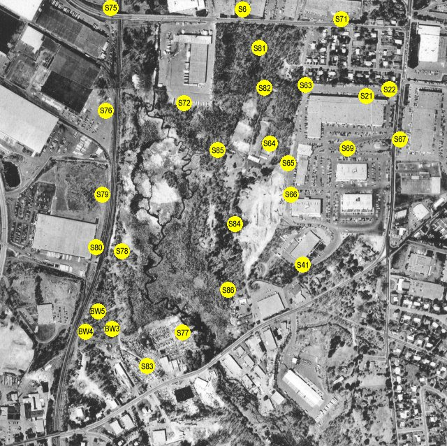

# Well Logs

## Well Log Overview

View a map of well log locations with symbols linked to well log documents. This section provides access to comprehensive well log data from the Woburn site.

## Interactive Well Log Map

The map below has clickable yellow dots that will open the corresponding well log PDF. Click on any yellow dot to view the well log for that location.

    
    
    <!-- Invisible clickable areas positioned over the original yellow dots -->
    

    

    

    

    

    

    

    

    

    

    

    

    

    

    

    

    

    

    

    

    

    

    

    

    

    

    

*Click on the yellow dots on the map above to view the corresponding well log PDF*

## Well Log Documents

### Monitoring Wells (S-series)

- [S6 Well Log](s6.pdf) - 186KB
- [S21 Well Log](s21.pdf) - 61KB  
- [S22 Well Log](s22.pdf) - 51KB
- [S41 Well Log](s41.pdf) - 53KB
- [S63 Well Log](s63.pdf) - 52KB
- [S64 Well Log](s64.pdf) - 85KB
- [S65 Well Log](s65.pdf) - 84KB
- [S66 Well Log](s66.pdf) - 49KB
- [S67 Well Log](s67.pdf) - 85KB
- [S69 Well Log](s69.pdf) - 73KB
- [S71 Well Log](s71.pdf) - 71KB
- [S72 Well Log](s72.pdf) - 165KB
- [S75 Well Log](s75.pdf) - 110KB
- [S76 Well Log](s76.pdf) - 193KB
- [S77 Well Log](s77.pdf) - 179KB
- [S78 Well Log](s78.pdf) - 141KB
- [S79 Well Log](s79.pdf) - 164KB
- [S80 Well Log](s80.pdf) - 120KB
- [S81 Well Log](s81.pdf) - 108KB
- [S82 Well Log](s82.pdf) - 77KB
- [S83 Well Log](s83.pdf) - 127KB
- [S84 Well Log](s84.pdf) - 120KB
- [S85 Well Log](s85.pdf) - 104KB
- [S86 Well Log](s86.pdf) - 90KB

### Background Wells (BW-series)

- [BW3 Well Log](bw3.pdf) - 83KB
- [BW4 Well Log](bw4.pdf) - 88KB
- [BW5 Well Log](bw5.pdf) - 84KB

## Data Format

All well logs are provided in PDF format for easy viewing and printing. Each file contains detailed information about the well construction, geology, and sampling data.

## Download Options

Click on any well log link above to view or download the PDF file. All files are optimized for web viewing while maintaining high quality for printing.

---

*Content extracted from the original Woburn website* 